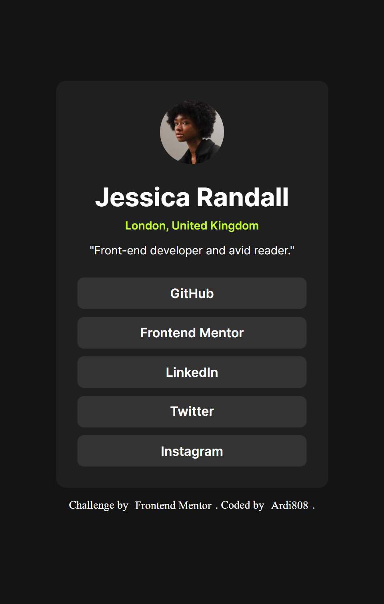
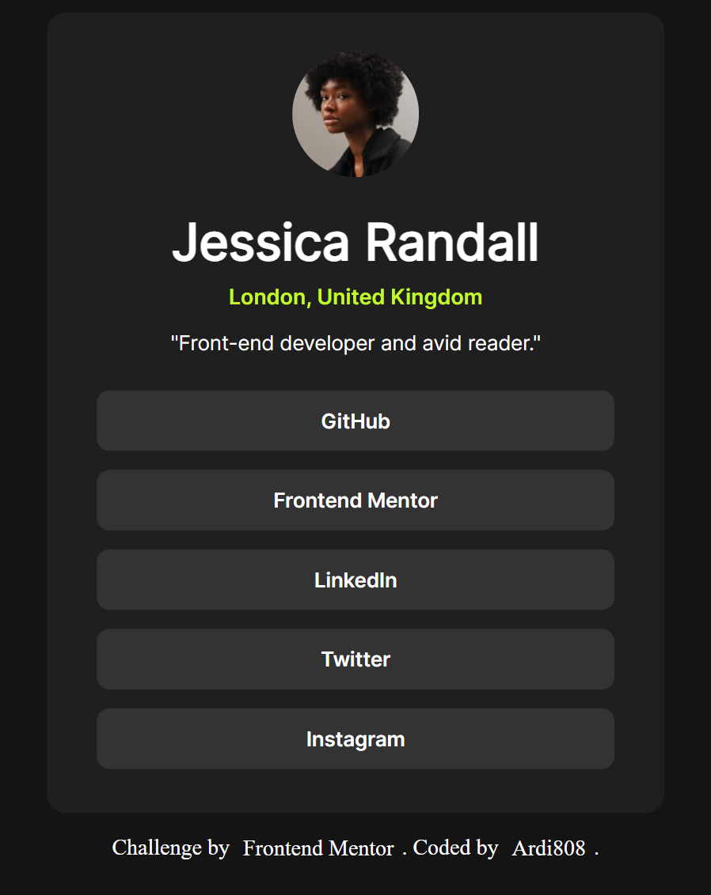

# Frontend Mentor - Social links profile solution

This is a solution to the [Social links profile challenge on Frontend Mentor](https://www.frontendmentor.io/challenges/social-links-profile-UG32l9m6dQ). Frontend Mentor challenges help you improve your coding skills by building realistic projects.

## Table of contents

- [Overview](#overview)
  - [The challenge](#the-challenge)
  - [Screenshot](#screenshot)
  - [Links](#links)
- [My process](#my-process)
  - [Built with](#built-with)
  - [What I learned](#what-i-learned)
  - [Continued development](#continued-development)
  - [Useful resources](#useful-resources)
- [Author](#author)

## Overview

### The challenge

Users should be able to:

- See hover and focus states for all interactive elements on the page

### Screenshot

**Desktop view**  

**Mobile view**  

### Links

- Solution URL: -
- Live Site URL: https://ardi808.github.io/social-links-profile-main/

## My process

### Built with

- Semantic HTML5 markup
- CSS custom properties
- Flexbox
- Mobile-first workflow
- Custom fonts with `@font-face`

### What I learned

This challenge helped me practice using **Flexbox** to center content and build a clean card layout.  
I also learned how to load and apply custom fonts with `@font-face`.

css
@font-face {
font-family: inter-bold;
src: url(../assets/fonts/static/Inter-Bold.ttf);
}

body {
display: flex;
justify-content: center;
align-items: center;
min-height: 100vh;
}

### Continued development

For future projects, I want to:

- Improve accessibility by adding better focus states.
- Use rem consistently for spacing instead of px.
- Explore CSS Grid for more complex layouts.

### Useful resources

- MDN Web Docs - Flexbox
- CSS Tricks - A Complete Guide to Flexbox

### Author

- GitHub - [Ardi808](https://github.com/Ardi808)

- Frontend Mentor - @Ardi808
